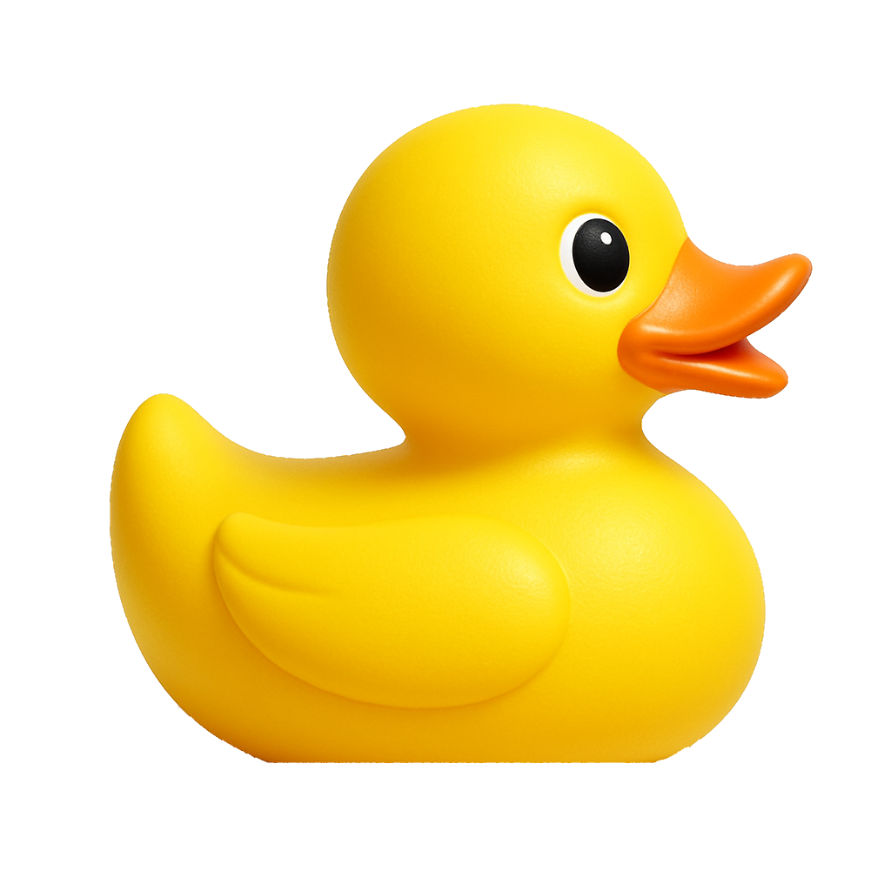

# DuckWordle 🦆

## Acerca de

**DuckWordle** es el clásico juego de Wordle en que debes adivinar una palabra de 5 letras, pero la diferencia es que todas las palabras son relacionadas a los **patos**. Este repositorio ha sido creado con fines recreativos y para el curso de *Algoritmos y Sistemas Computacionales (IIC1001)* de la carrera Licenciatura en Ingeniería en Ciencia de la Computación de la Pontificia Universidad Católica de Chile.